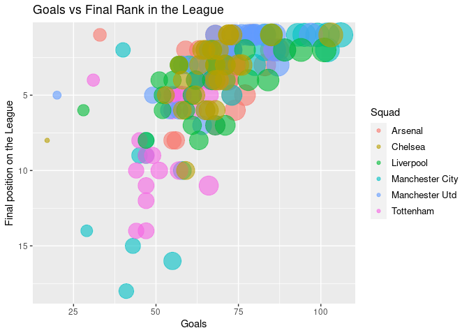
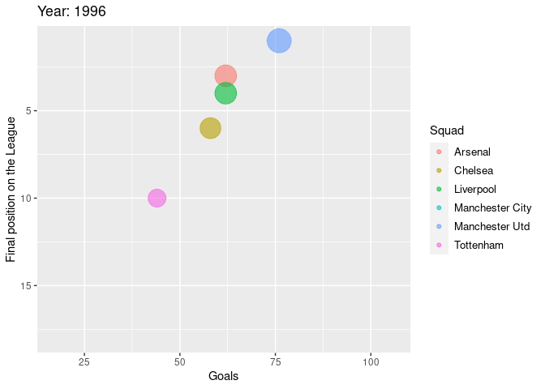
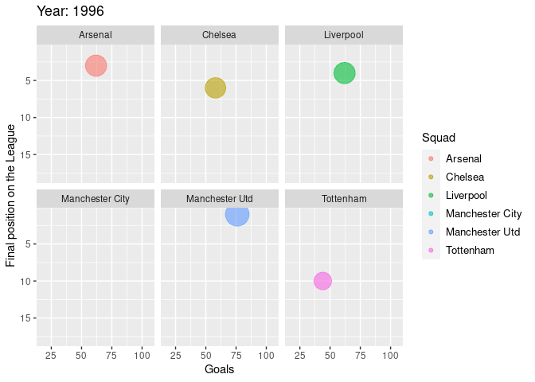
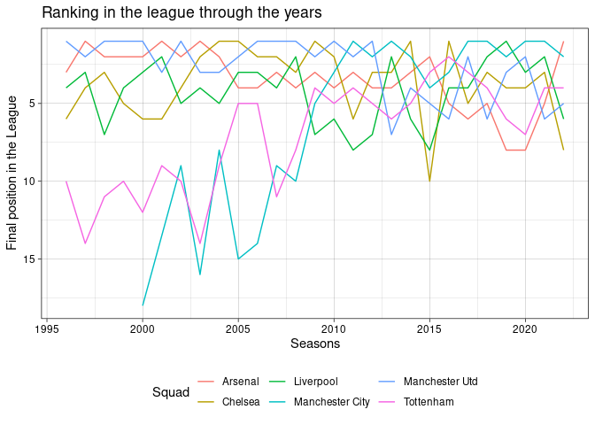
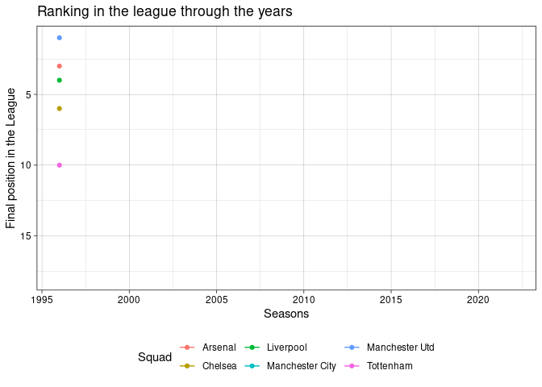
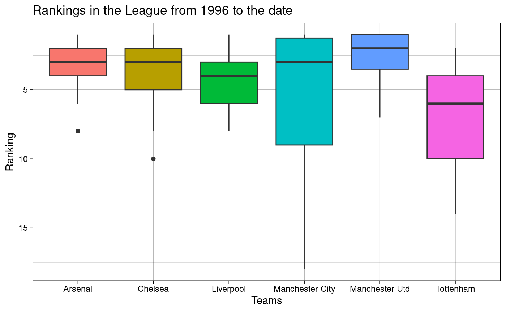
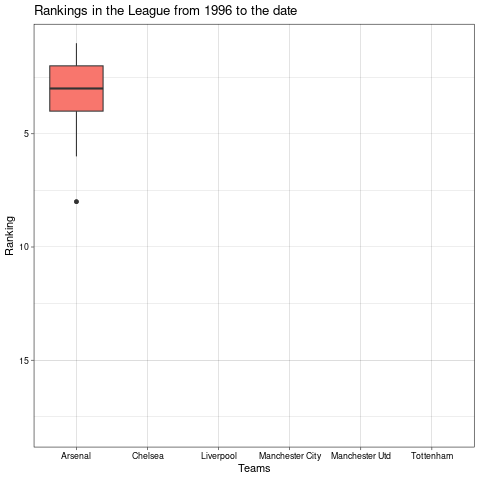

## loading the Packages and reading the csv file

    library(readr)
    library(ggplot2)
    library(gganimate)
    library(gifski)
    teams <- read_csv("PremierLeagueTeams.csv")

## First rows

    head(teams)

    ## # A tibble: 6 × 13
    ##   Season Squad   Country Comp   LgRank    MP     W     D     L    GF    GA   Pts
    ##    <dbl> <chr>   <chr>   <chr>   <dbl> <dbl> <dbl> <dbl> <dbl> <dbl> <dbl> <dbl>
    ## 1   2022 Arsenal eng ENG 1. Pr…      1    14    12     1     1    33    11    37
    ## 2   2021 Arsenal eng ENG 1. Pr…      5    38    22     3    13    61    48    69
    ## 3   2020 Arsenal eng ENG 1. Pr…      8    38    18     7    13    55    39    61
    ## 4   2019 Arsenal eng ENG 1. Pr…      8    38    14    14    10    56    48    56
    ## 5   2018 Arsenal eng ENG 1. Pr…      5    38    21     7    10    73    51    70
    ## 6   2017 Arsenal eng ENG 1. Pr…      6    38    19     6    13    74    51    63
    ## # … with 1 more variable: Attendance <dbl>

## Correlation between Goals and Final Position in the league per Season

    teams$Season <- as.integer(teams$Season)
    teams$LgRank <- as.integer(teams$LgRank)
    p <- ggplot(teams,aes(GF, LgRank, size = GF, color = Squad)) +
      geom_point(alpha = 0.6) +
      labs(title="Goals vs Final Rank in the League",x = "Goals", y = "Final position on the League") +
      scale_y_reverse()  +
      theme(legend.text = element_text(size=10)) +
      scale_size(range = c(2, 12), guide="none") 
    p

## Now lets animate the plot

    p + transition_time(Season) +
      labs(title = "Year: {frame_time}") 

## Separate the plot by Team

    p + facet_wrap(~Squad) +
      transition_time(Season) +
      labs(title = "Year: {frame_time}")

## Line plot

    a <- ggplot(teams,aes(Season,LgRank, group = Squad, color = Squad)) +
      geom_line() +
      labs(title= "Ranking in the league through the years",x = "Seasons", y = "Final position in the League") +
      scale_y_reverse() +
      theme_linedraw() +
      theme(legend.position = "bottom")
      
      
    a

## Animation

    a + geom_point() +
      transition_reveal(Season)

## Now let's divide the plot per team

    a + facet_wrap(~Squad) +
      geom_point() +
      transition_reveal(Season)

## Rankings by Season played from 1996

    b <- ggplot(teams,aes(Squad,LgRank,fill=Squad)) +
      geom_boxplot() +
      labs(title="Rankings in the League from 1996 to the date",x="Teams",y="Ranking") +
      theme_linedraw() +
      theme(legend.position = "none") +
      scale_y_reverse()
    b

## Animating the boxplot

    b + transition_states(Squad, wrap = FALSE) +
      shadow_mark() +
      enter_grow()
    b

## References

Packages(ggplo2,gganimate,gifsky)

Rstudio.cloud

programming language: R

Dataset: Big leagues players stats from Fbref.com
